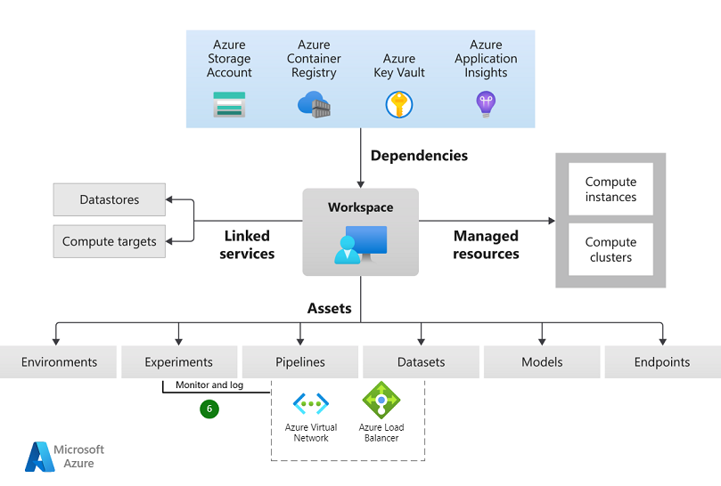
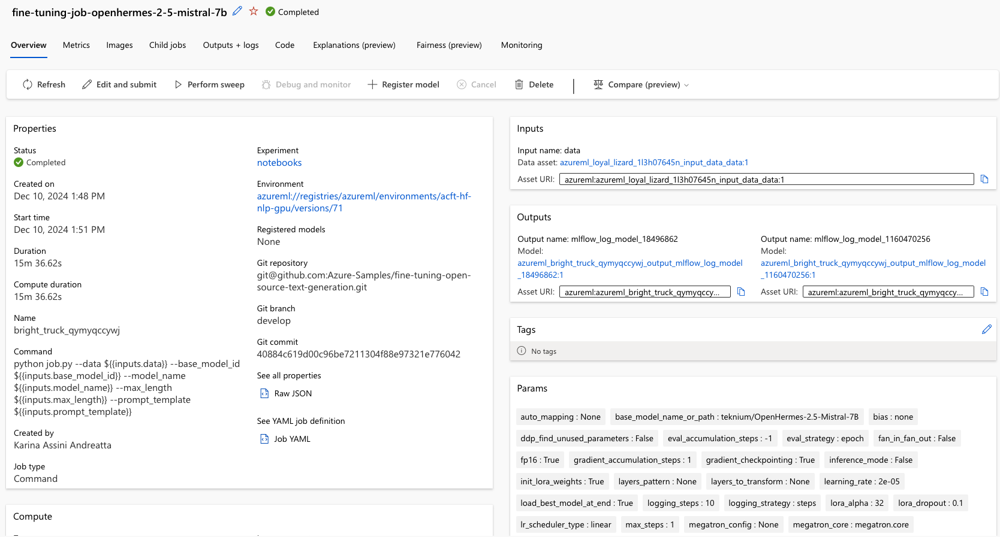
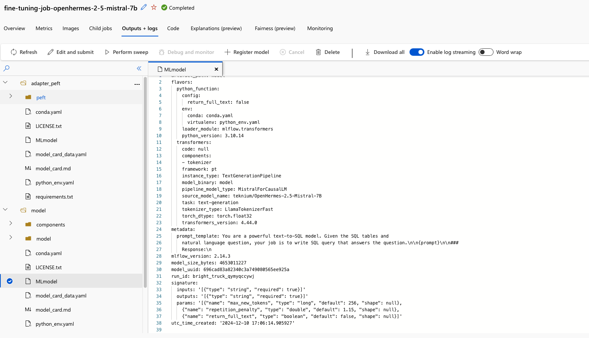

# 
# Fine Tuning Open Source LLM Models - QLora and Lora features implemented

## Overview
Open-source LLMs are powerful but require fine-tuning for specific tasks like chatbots or content generation. Fine-tuning these models can be expensive due to the need for substantial VRAM. For instance, fully fine-tuning the Llama7B model requires 112GB of VRAM. However, techniques like QLoRA and PEFT can significantly reduce these requirements.

In this repo, we demonstrate how to fine-tune the Mistral 7B/OpenHermes model for a **text-to-SQL** task. 

We can load models from various sources: azure model catalog, local folder, or the Hugging Face website. The main notebook here demonstrates how to load models directly from Hugging Face. If the Azure model catalog contains the model you need, you can use it by either registering the model in your workspace or accessing it directly from the catalog registry.


### Objectives and Features
1. Learn the typical LLM fine-tuning process.
2. Utilize **QLoRA** and **PEFT** to overcome GPU memory limitations.
3. Use **MLflow** to manage model training, logging artifacts, hyperparameters, metrics, and prompts.
4. Save prompt templates and inference parameters in MLflow for simplified prediction interfaces.


### Key Components - Main Notebook
* [teknium/OpenHermes-2.5-Mistral-7B](https://huggingface.co/teknium/OpenHermes-2.5-Mistral-7B): A 7-billion parameter text-generation model optimized with techniques like Group-Query Attention and Sliding-Window Attention.
* [QLoRA](https://github.com/artidoro/qlora): Reduces trainable parameters and applies 4-bit quantization to minimize memory usage.
* [PEFT](https://huggingface.co/docs/peft/en/index): Simplifies the integration of optimization methods with pretrained models.
* [MLflow](https://mlflow.org/): Manages configurations, assets, and metrics during LLM training, integrated with Transformers and PEFT.


## Prerequisites
+ [azd](https://learn.microsoft.com/azure/developer/azure-developer-cli/install-azd), used to deploy all Azure resources and assets used in this sample.

+ [PowerShell Core pwsh](https://github.com/PowerShell/powershell/releases) if using Windows

+ Python 3.11

## Setup environment

This sample uses [`azd`](https://learn.microsoft.com/azure/developer/azure-developer-cli/) and a bicep template to deploy all Azure resources, including the Azure OpenAI models.

1. Login to your Azure account: `azd auth login`

2. Create an environment: `azd env new`

3. Run `azd up`.

   + Choose a name for your resourge group.
   + Enter a region for the resources.

   The deployment creates multiple Azure resources and runs multiple jobs. It takes several minutes to complete. The deployment is complete when you get a command line notification stating "SUCCESS: Your up workflow to provision and deploy to Azure completed."


# 

### Quickstart

```bash
git clone https://github.com/Azure-Samples/fine-tuning-open-source-text-generation.git
```

### Instalation 
The Makefile is designed to set up a Python development environment using pyenv, conda, and poetry. Here's a step-by-step explanation of what each part does:

To run the Makefile included in this project, follow these steps:

1. Open a terminal and navigate to the project directory:
    ```sh
    fine-tuning-open-source-text-generation
    ```

2. Run the Makefile using the `make` command:
    ```sh
    make <target>
    ```

This will execute the default target specified in the Makefile. If you want to run a specific target, use:
Replace `<target>` with the name of the target you want to run.

This uses `condaenv` instead of `poetryenv` because Azure Machine Learning is built with `conda` and it can be easier to use when running code within Azure Machine Learning notebooks. If you are using VS Code and linking to the proper compute, you can modify the Makefile to use the `poetry` environment, or keep it as is, both will work properly.


### Setup your .env

If your model requires a token, it should be set in the `.env` file.


## Config

The config.py file provides a structured way to manage various configuration settings for different stages of a machine learning project, including modeling, deployment, and training. By using data classes and the pydantic library, it ensures type safety and easy loading/saving of configurations from/to YAML files.


## Demo

A demo app is included to show how to use the project.

To run the demo, follow these steps:

1. Open the Jupyter Notebook file located in the `notebooks` folder.
2. Run all the cells in the notebook to execute the demo.
3. The results will be displayed within the notebook cells. Open up your AML workspace to analyze the results bellow:


    - Open your web browser and go to the Azure Machine Learning Studio at https://ml.azure.com.
    - Ensure you are in the correct Azure Machine Learning workspace where you ran your fine-tuning job.
    - In the left-hand navigation pane, click on the "Jobs" tab. This will display a list of all the jobs that have been run in your workspace.
    - Find the job corresponding to your fine-tuning task. You can use the search bar to filter jobs by name, or sort the list by date to find the most recent jobs.
    - Click on the job name to open the job details page. This page provides comprehensive information about the job, including its status, logs, metrics, and outputs.
    - In the "Outputs + logs" tab, you can find the artifacts generated by the job. This includes the trained model, configuration files, and any other files saved during the job. You can download these artifacts for further analysis or use them in subsequent steps.

If you have integrated MLflow with your job, you can also check the MLflow run associated with the job. This will provide additional details about the parameters, metrics, and artifacts logged during the training process. You can access the MLflow UI by clicking on the "MLflow run" link in the job details page.


Here is an example of the expected output:






## Contributing

We welcome contributions! Please read our [contributing guidelines](CONTRIBUTING.md) before submitting a pull request.

## License

This project is licensed under the MIT License. See the [LICENSE](LICENSE) file for details.

## Contact

For any questions or feedback, please open an issue on GitHub.


## Conclusion
This notebook demonstrates the process of fine-tuning an open-source LLM using QLoRA and PEFT, managing the training process with MLflow, and deploying the fine-tuned model using Azure ML.
